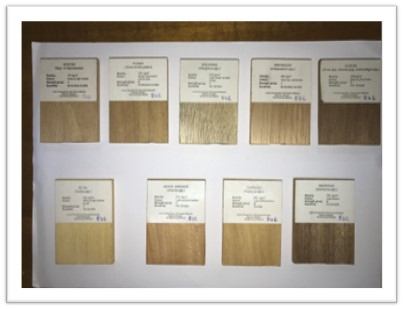
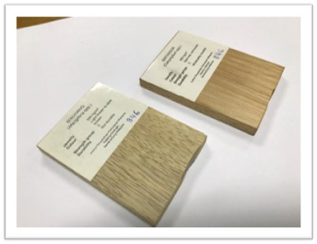
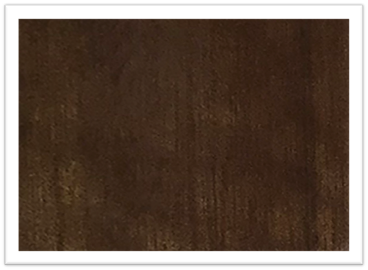
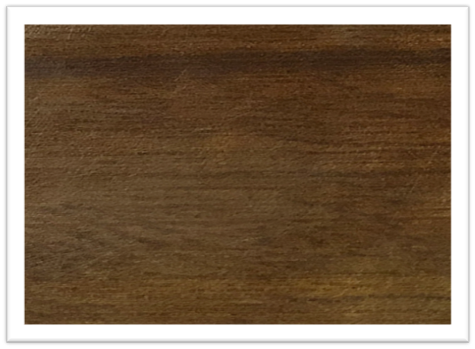
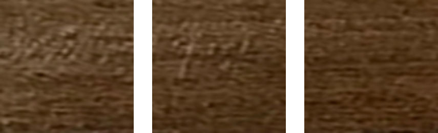
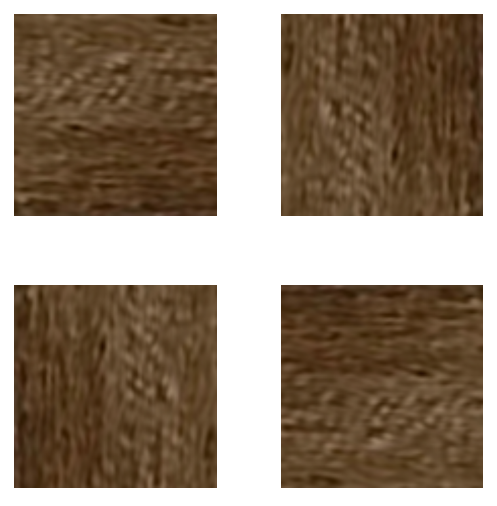
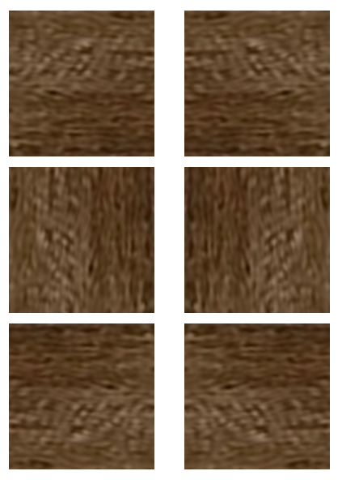
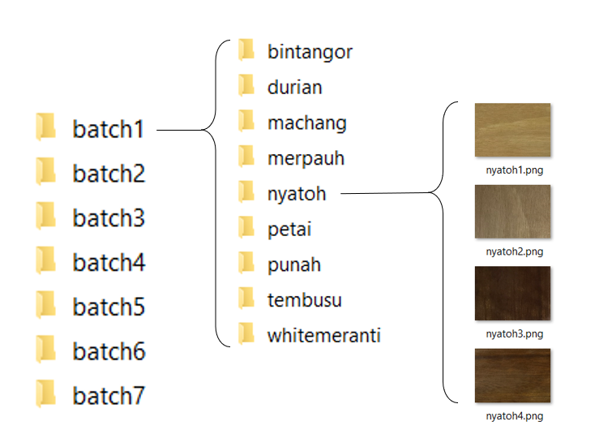
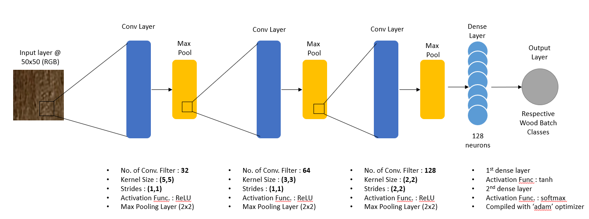

# ml-wood-my-public
My deep learning project during my intern at MIMOS BERHAD

*Disclaimer:* This project is considered confidential, as the data is from the client side. You cannot run the .ipynb file independently. Contact me should you need more info.

## Project Objectives

1. To assist in the project's machine learning approach
2. To develop an image classifier for wood species.

## Project Scope

1. Algorithm used: Convolutional Neural Network (CNN)
2. Development using KERAS high level API built on TensorFlow

## Dataset

- Images are limited
- Need to expand dataset

### Data Pre-Processing

  

    
  

  

    
  

These are the 2 types of raw images we have, later to be cropped per species.

  

    
  

  

    
  

Differences in lighting and orientation are what makes the images unique to each other.

#### Cropping

- Each images are cropped to yield more images
- A total of 300 sub images are cropped from a single image

The first 3 of the sub images

### Rotating

- Each sub-images are rotated 4 times
- This will net us 300 x 4 = 1200 total sum of new sub-images

The first image is rotated 4x

### Mirroring

- Lastly, each sub-images are mirrored one time
- Our total image we can get from *a single image* now multiplies to 1200 x 2 = *2400* new sub images.

Each image are mirrored one time.

## File directory

The pictures are divided into batches of wood species, onto their respectives folders.

*Total images count = 168 000 images*

## Model Architecture

## Results

Our final accuracy for this model is *86.45%*
